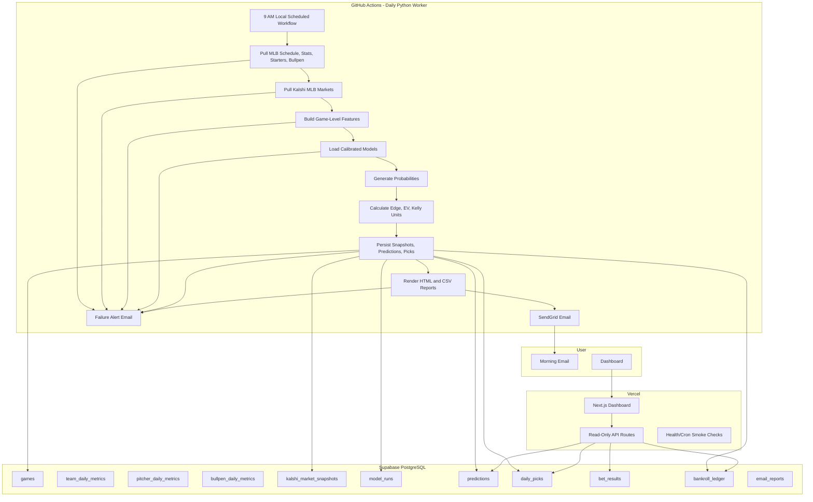

# MLB Kalshi Edge Platform Architecture

## Recommended Production Architecture

The most reliable deployment is **Option A: Vercel dashboard + GitHub Actions Python worker + Supabase + SendGrid**.

Heavy MLB feature generation and model inference depend on Python packages that are awkward in Vercel Functions. GitHub Actions provides a reliable scheduled Linux runtime, dependency caching, job logs, retries, and secret management without adding another paid worker service.

## Design Decisions

1. **Expected value first.** The platform estimates true game probabilities and compares them with Kalshi prices. It does not label "winners" unless the price creates positive expected value.
2. **No Vercel-heavy Python.** Vercel hosts the dashboard and lightweight API routes. The Python ML pipeline runs in GitHub Actions where scientific dependencies are stable.
3. **Supabase as source of truth.** Every model run, market snapshot, pick, result, bankroll movement, and email send is persisted for auditability.
4. **Time-based modeling.** Training and evaluation are chronological to avoid leakage from future games.
5. **Calibrated probabilities.** Logistic regression is the baseline. XGBoost is primary when installed, wrapped with calibration to improve probability quality.
6. **Confirmed-starter gating.** Bets are only recommended when starting pitchers are confirmed or explicitly trusted by the data source.
7. **Risk controls by default.** Fractional Kelly is capped by per-bet and daily exposure limits. Fixed-unit sizing is available.
8. **Idempotent daily runs.** The worker upserts by dates and external IDs so reruns update the same slate instead of duplicating records.

## Daily Workflow

1. Fetch today's MLB schedule.
2. Fetch team, pitcher, bullpen, context, and recent-form metrics.
3. Fetch Kalshi market prices.
4. Build one game-level feature row per game.
5. Generate home/away win probabilities.
6. Match each game to Kalshi markets.
7. Calculate implied probability, edge, expected value, confidence, and bet size.
8. Store all raw snapshots and derived recommendations.
9. Send a mobile-friendly SendGrid report at 9:00 AM local time.
10. Send an error report if any critical step fails.

## Deployment Boundary

Vercel owns:

- Next.js dashboard.
- API routes that read Supabase.
- Optional cron smoke endpoint.

GitHub Actions owns:

- Daily data pull.
- Model training or inference.
- Report generation.
- SendGrid delivery.

Supabase owns:

- PostgreSQL schema.
- Row-level security policies.
- Historical audit tables.

